# ptfe-prodmount-vc-cloud
Install Prod Mount disk PTFE version with Valid Certificate - cloud

Based on the repo: https://github.com/Galser/ptfe-demo-validcert

# Purpose
This repo contains all the code and instructions on how to install PTFE (Prod) version with a Valid Certificate in a cloud environment in mounted disk mode.

# Requirements

This repository assumes general knowledge about Terraform, if not, please get yourself accustomed first by going through [getting started guide for Terraform](https://learn.hashicorp.com/terraform?track=getting-started#getting-started). We also going to use Vagrant with VirtualBox.

To learn more about the mentioned above tools and technologies -  please check section [Technologies near the end of the README](#technologies)


# How-to

## Build infrastructure
- You will need to have SSH key in RSA format available at the default location :
  - `~/.ssh/id_rsa` and `~/.ssh/id_rsa.pub`
  This key is going to be used later to connect to the instance where TFE will be running.
  
- Prepare AWS auth credentials (You can create security credentials on [this page](https://console.aws.amazon.com/iam/home?#security_credential).) via env variables, execute in the command line :
    ```
    export AWS_ACCESS_KEY_ID="YOUR ACCESS KEY"
    export AWS_SECRET_ACCESS_KEY="YOUR SECRET KEY"
    ```
- Prepare GoDaddy authentication for your domain DSN management - register and export as env variables GoDaddy API keys.
    - Use this link : https://developer.godaddy.com/keys/ ( pay attention that you are creating API KEY IN **production** area)
    - Export them via :
    ```bash
    export GODADDY_API_KEY=MY_KEY
    export GODADDY_API_SECRET=MY_SECRET
    ```
- Install [GoDaddy plugin](https://github.com/n3integration/terraform-godaddy) for Terraform. Run from command line :  
    ```bash
    bash <(curl -s https://raw.githubusercontent.com/n3integration/terraform-godaddy/master/install.sh)
    ```
    - This is going to create plugin binary in `~/.terraform/plugins` , while the recommended path should be `~/.terraform.d/plugins/`, and the name should be in a proper format pattern . let's move and rename it :
    ```bash
    mv ~/.terraform/plugins/terraform-godaddy ~/.terraform.d/plugins/terraform-provider-godaddy
    ```
- Clone this repo (*use the tools of your choice*)
- Open the folder with cloned repo
- Define you own domain name in [variables.tf](variables.tf), edit on 2-nd line, following block : 
  ```terraform
  variable "site_domain" {
    default = "guselietov.com"
  }
  ```
- From inside folder with cloned repo init Terraform by executing : 
```
terraform init
```
- Now let's spin up everything, by executing :
```
terraform apply -auto-approve
```
Execution will take some time, and at the very end of the output you should see something similar to : 
```bash
Outputs:

backend_fqdn = ptfe-pm-1_backend.guselietov.com
cert_url = https://acme-v02.api.letsencrypt.org/acme/cert/035a5ed202a09ab4f926a4d99ae50f9bdfb5
full_site_name = ptfe-pm-1.guselietov.com
loadbalancer_fqdn = ag-tfe-clb-493767462.eu-central-1.elb.amazonaws.com
public_dns = ec2-18-184-220-142.eu-central-1.compute.amazonaws.com
public_ip = 18.184.220.142
```
- Please note that the successfull `apply` should create 3 files with SSL certificate information in local folder : 
  ```bash
  # ls -l site*
  -rwxr-xr-x  1 andrii  staff  1939 Oct 29 11:54 site_ssl_cert.pem
  -rwxr-xr-x  1 andrii  staff  3589 Oct 29 11:54 site_ssl_cert_bundle.pem
  -rwxr-xr-x  1 andrii  staff  1675 Oct 29 11:54 site_ssl_private_key.pem
  ```
  We are going to use them later. 

## Terminal-based portion of TFE installation
- Connect to VM : 
```
ssh ubuntu@18.184.220.142
``` 
> Note : Use the `public_ip` or `backend_fqdn` from the previous step

- Start the PTFE install: 
```curl https://install.terraform.io/ptfe/stable | sudo bash```
    - use Public IP-address from previous steps ( `18.184.220.142` in the example ) for the service question
    - Reply `No` to proxy question.
    Output example : 
  ```bash
    % Total    % Received % Xferd  Average Speed   Time    Time     Time  Current
                                  Dload  Upload   Total   Spent    Left  Speed
  100  118k  100  118k    0     0  48967      0  0:00:02  0:00:02 --:--:-- 48967
  Determining local address
  The installer will use network interface 'ens5' (with IP address '172.31.2.88')
  Determining service address
  The installer will use service address '18.184.220.142' (discovered from EC2 metadata service)
  The installer has automatically detected the service IP address of this machine as 18.184.220.142.
  Do you want to:
  [0] default: use 18.184.220.142
  [1] enter new address
  Enter desired number (0-1): 0
  Does this machine require a proxy to access the Internet? (y/N) n
  Installing docker version 18.09.2 from https://get.replicated.com/docker-install.sh
  # Executing docker install script, commit: UNKNOWN 
  ...
  + sh -c apt-get update -qq >/dev/null
  + sh -c apt-get install -y -qq apt-transport-https ca-certificates curl >/dev/null...
  Operator installation successful

  To continue the installation, visit the following URL in your browser:

    http://18.184.220.142:8800

  ```

## Web-based portion of TFE installation
- Open your favorite browser and access the link that had been presented to you at the previous step: http://18.184.220.142:8800,  As we using self-signed certificates for this part of the installation, you will see a security warning when first connecting. **This is expected and you'll need to proceed with the connection anyway.**
- Now you will be presented with settings screen :
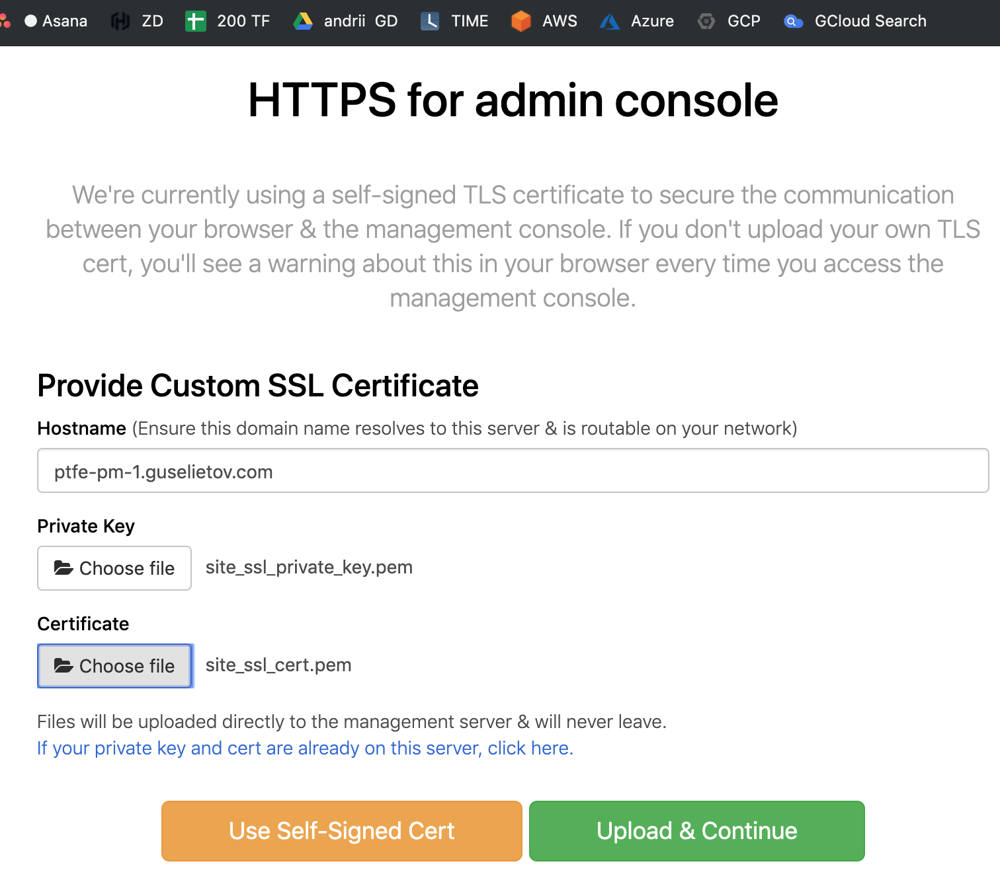
    Where you will need to
    - enter hostname: `ptfe-pm-1.guselietov.com` *( this used in exaxmple,. you may have another one, if you modified settings earlier)*
    - Choose File for Private Key ( point to `site_ssl_private_key.pem` in the current folder)
    - Choose File for Certificate ( point to `site_ssl_cert.pem` in the current folder)
    - and press green button **[Upload & Continue]**
- Now you will need to present your license file. Usually, it comes in a special tar-ball package with extension RLI. Press **[Choose license] **, Locate the file and upload.
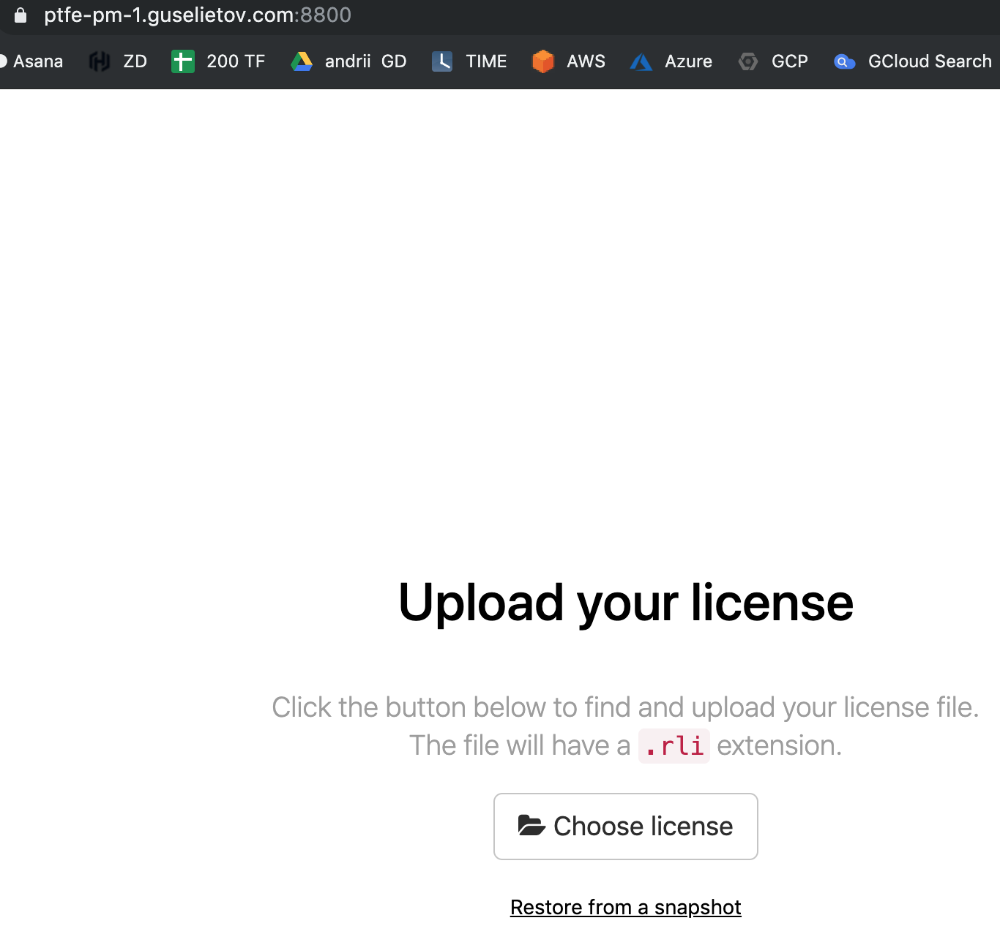
    > And you can also see - that you've been automatically redirected to the new URL: `https://ptfe-pm-1.guselietov.com:8800/`
    > and that the "lock" icon next to the FQDN of the site in the URL bar is closed, meaning that certificate recognized as valid by the browser and corresponds to the address of the site.
- The next screen allows you to select between *Online* and *air-gapped* installation. Choose **[Online]** :

And press **[Continue]** button
- On the next step, you will need to enter the password, that can be used in the future to access THIS, Admin Console :
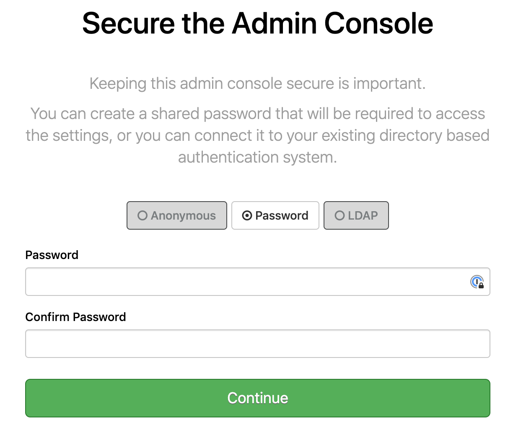
Enter the desired password, and press continue
- Now you will see the "Preflight Checks" when all the main requirements for the PTFE installation checked and presented to you the top of the screen looks like :
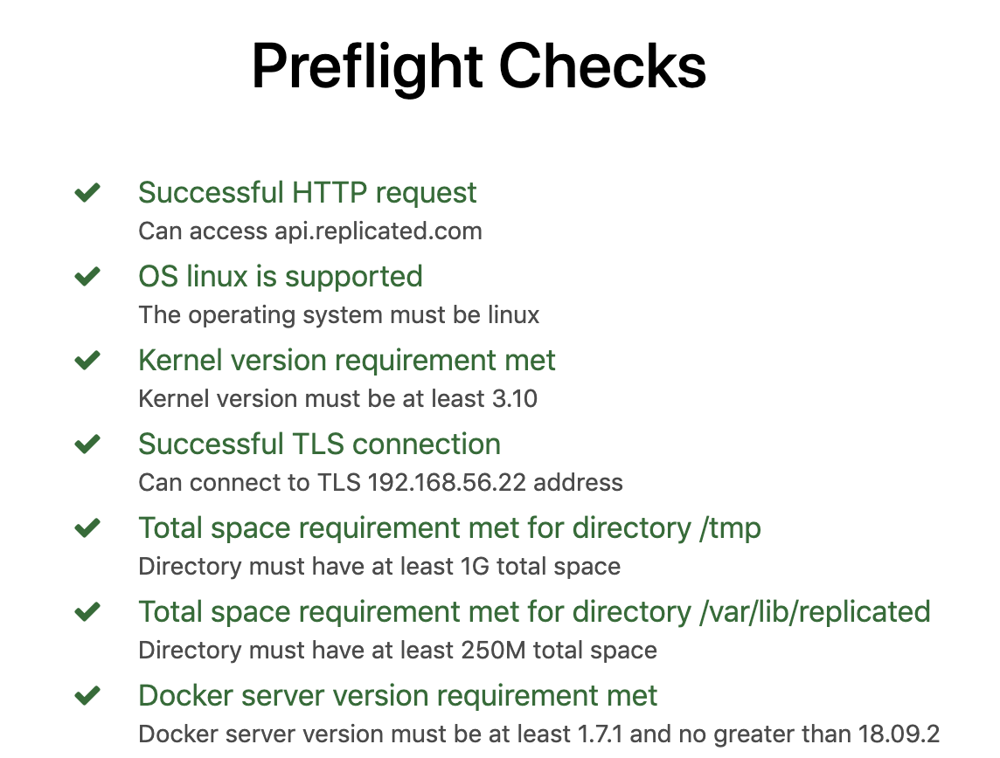
Once more, press **[Continue]** button
- The next screen presents all your settings in one place
    - Check that host FQDN is correct
    - Scroll down to the *Installation Type* section and select **[Production]**
    - Now in the next section *Production Type* select **[Mounted Disk]**
    - Below it, in the *Mounted Disk Configuration* enter path : `/tfe-data`
    Check the screenshopt for guidance : 
    
    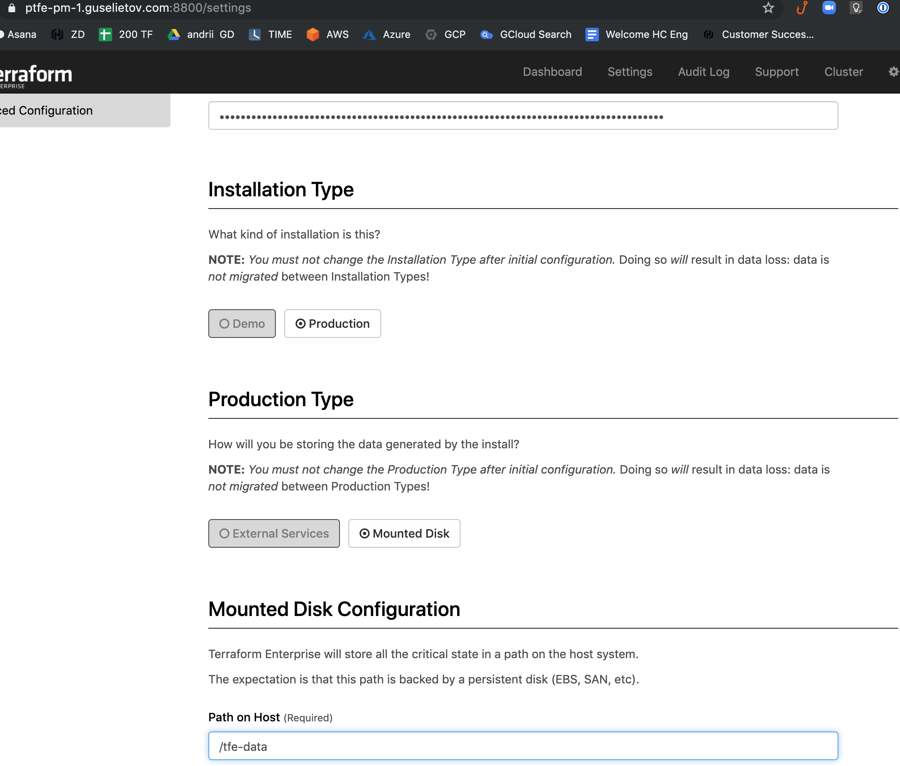
    
    - Scroll to the next section: *SSL/TLS Configuration* - and paste the contents of your SSL Certificate bundle here
    ( Use the contents of the file `site_ssl_cert_bundle.pem` from current folder)
    After that - press **[Save]** button at the bottom of the page to save all your settings. And you going to be present with the following informational screen :
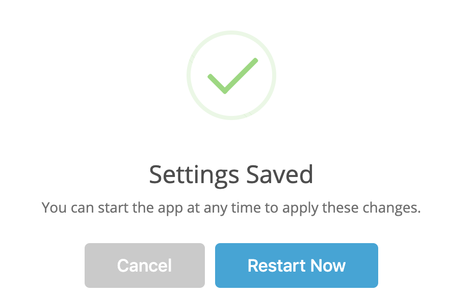
 Press **[Restart Now]**
- At his moment PTFE will do a full start of all internal services, it can take a couple of minutes, refresh the windows from time to time :

  > Note:..Depending on your browser and/or browser settings the starting in the left part of Dashboard - never changes unless you reload the page. So force-reload the page after 2-3 minutes.
- Wait a couple of minutes for the state at the left rectangle to be changed to **Started**. Now, below the button [Stop now] there is link **[Open]** :

    

    Open it, this will lead you to the first-time setup of the admin user :
- Set up your admin user :
    
    Fill in the form and press **[Create an account]**
- Now you are logged in the brand fresh Private Terraform Enterprise. Congratulations. You can check the next section on how to test it.


# Test your installation

To test our fresh PTFE instance, we are going to create an organization. workspace within that organization, some TF code and execute that code in that workspace as in the remote backend.

- We need first to create an **organization** (Organizations are a shared space for teams to collaborate on workspaces in PTFE). Login into PTFE. Choose from the dashboard "Create new organization" (also available in the top-left user menu) :
    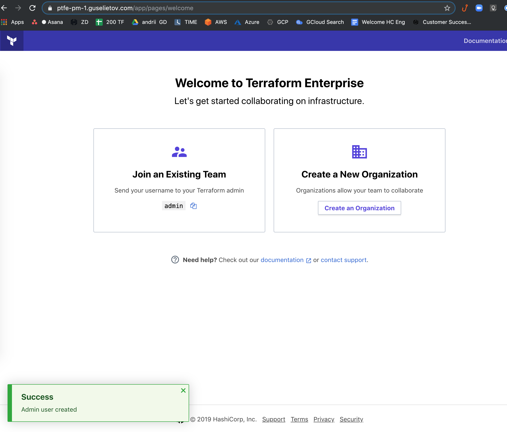

    For this example, we are going to use **"acme"** :

    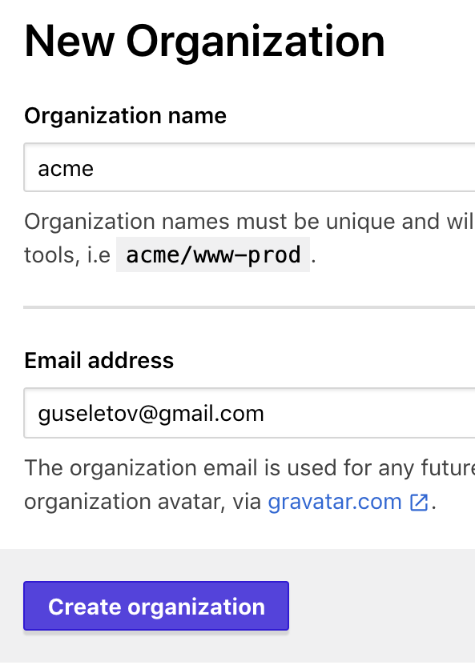

    

- Now you are going to be prompted to **Create workspace** :
skip **Connecting to VCS**, we don't need it for now. Enter the workspace name at the last screen :

    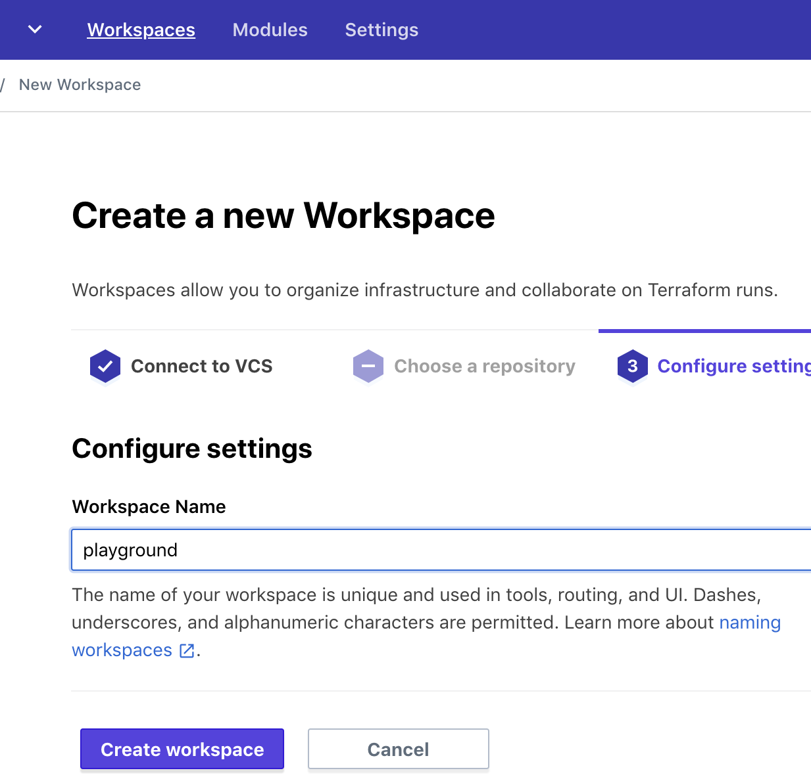

    For this example, we are going to use **"playground"** and some email.

    And press button **[Create workspace]**

- The next step is to create a token, that will authenticate our connection. Go to the **User Settings menu** (top-right corner of the page) and select User  Setting --> then Tokens ( https://ptfe-pm-1.guselietov.com/app/settings/tokens ) :
  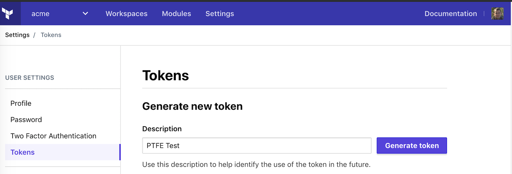
  Fill the description and press button **[Generate token]**
  Write down the value or copy it to clipboard
- Add the freshly generated token to Terraform CLI config (See in details here: https://www.terraform.io/docs/commands/cli-config.html#credentials )
    - For *macOS Mojave* this means adding a section to the file named `.terraformrc` (note the leading period) and placed directly in the home directory of the relevant user, with content similar to :
      ```terraform
      credentials "ptfe-pm-1.guselietov.com" {
          token = "TOKEN" # <-- you token goes here in quotes
      }
      ```
- Change directory to [tf-test](tf-test) sub-fodler in the cloned repo :
  ```
  cd tf-test
  ```
- There is code, pre-populated specifically for test : 
  ```terraform
  terraform {
    backend "remote" {
      hostname     = "ptfe-pm-1.guselietov.com"
      organization = "acme"

      workspaces {
        name = "playground"
      }
    }
  }

  resource "null_resource" "helloPTFE" {
    provisioner "local-exec" {
      command = "echo hello world in PTFE"
    }
  }
  ```
- Init Terraform fro the test code:
  ```bash
  terraform init

  Initializing the backend...

  Successfully configured the backend "remote"! Terraform will automatically
  use this backend unless the backend configuration changes.

  Initializing provider plugins...
  - Checking for available provider plugins...
  - Downloading plugin for provider "null" (hashicorp/null) 2.1.2...

  The following providers do not have any version constraints in configuration,
  so the latest version was installed.

  To prevent automatic upgrades to new major versions that may contain breaking
  changes, it is recommended to add version = "..." constraints to the
  corresponding provider blocks in configuration, with the constraint strings
  suggested below.

  * provider.null: version = "~> 2.1"

  Terraform has been successfully initialized!

  ```
- Terraform apply :
  ```bash
  terraform apply
  Running apply in the remote backend. Output will stream here. Pressing Ctrl-C
  will cancel the remote apply if it's still pending. If the apply started it
  will stop streaming the logs, but will not stop the apply running remotely.

  Preparing the remote apply...

  To view this run in a browser, visit:
  https://ptfe-pm-1.guselietov.com/app/acme/playground/runs/run-nm8qhb6uRY5D7Qr3

  Waiting for the plan to start...

  Terraform v0.12.2

  Configuring remote state backend...
  Initializing Terraform configuration...
  2019/10/29 08:18:40 [DEBUG] Using modified User-Agent: Terraform/0.12.2 TFE/ad6f6a1d83
  Refreshing Terraform state in-memory prior to plan...
  The refreshed state will be used to calculate this plan, but will not be
  persisted to local or remote state storage.


  ------------------------------------------------------------------------

  An execution plan has been generated and is shown below.
  Resource actions are indicated with the following symbols:
    + create

  Terraform will perform the following actions:

    # null_resource.helloPTFE will be created
    + resource "null_resource" "helloPTFE" {
        + id = (known after apply)
      }

  Plan: 1 to add, 0 to change, 0 to destroy.

  Do you want to perform these actions in workspace "playground"?
    Terraform will perform the actions described above.
    Only 'yes' will be accepted to approve.

    Enter a value: yes

  2019/10/29 08:18:56 [DEBUG] Using modified User-Agent: Terraform/0.12.2 TFE/ad6f6a1d83
  null_resource.helloPTFE: Creating...
  null_resource.helloPTFE: Provisioning with 'local-exec'...
  null_resource.helloPTFE (local-exec): Executing: ["/bin/sh" "-c" "echo hello world in PTFE"]
  null_resource.helloPTFE (local-exec): hello world in PTFE
  null_resource.helloPTFE: Creation complete after 0s [id=8447053125194314224]

  Apply complete! Resources: 1 added, 0 changed, 0 destroyed.
  ```
  Success! E.g. our fresh PTFE installation with valid SSL certificate works as expected. On the screenshot below you can see the state both in WebUI (at the left) and CLI (at the right side) :
    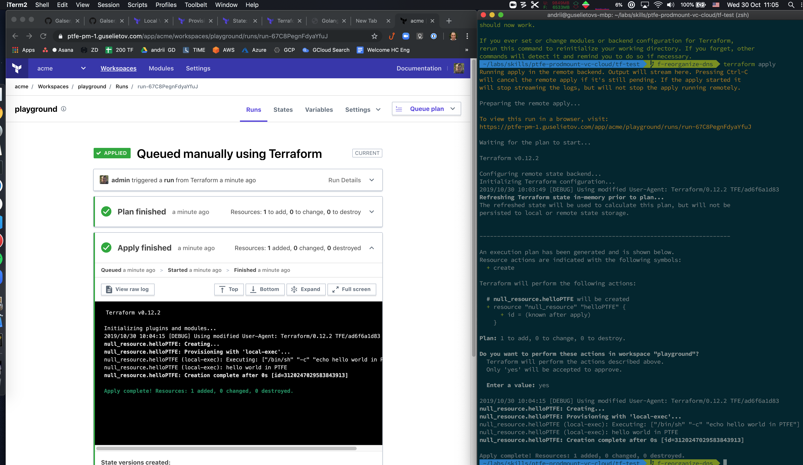


# TODO

- [ ] redeploy PTFE to test instructions
- [ ] update README

# DONE
- [x] define objectives 
- [x] create code for instance deploys and EBS creation
  - [x] DNS module
  - [x] create SSL keys/cert module
  - [x] instance module/code ( including EBS)
  - [x] main code
- [x] install TFE in Prod mode, write down steps
- [x] add VPC and security group creation
- [x] create instruction block

# Notes 

To make main README less obscure notes been extracted into a separate file : [notes.md](notes.md)


# Technologies

1. **To download the content of this repository** you will need **git command-line tools**(recommended) or **Git UI Client**. To install official command-line Git tools please [find here instructions](https://git-scm.com/book/en/v2/Getting-Started-Installing-Git) for various operating systems. 

2. **For managing infrastructure** we using Terraform - open-source infrastructure as a code software tool created by HashiCorp. It enables users to define and provision a data center infrastructure using a high-level configuration language known as Hashicorp Configuration Language, or optionally JSON. More you encouraged to [learn here](https://www.terraform.io).

More specifically we going to use Terraform Enterprise 
TFE Overview: https://www.terraform.io/docs/enterprise/index.html

Pre-Install checklist: https://www.terraform.io/docs/enterprise/before-installing/index.html

3. **This project for virtualization** uses **AWS EC2** - Amazon Elastic Compute Cloud (Amazon EC2 for short) - a web service that provides secure, resizable compute capacity in the cloud. It is designed to make web-scale cloud computing easier for developers. You can read in details and create a free try-out account if you don't have one here :  [Amazon EC2 main page](https://aws.amazon.com/ec2/) 

4. **GoDaddy** - GoDaddy Inc. is an American publicly traded Internet domain registrar and web hosting company, headquartered in Scottsdale, Arizona, and incorporated in Delaware. More information here: https://www.godaddy.com/

5. **Let'sEncrypt** - Let's Encrypt is a non-profit certificate authority run by Internet Security Research Group that provides X.509 certificates for Transport Layer Security encryption at no charge. The certificate is valid for 90 days, during which renewal can take place at any time. You can find out more on their [official page](https://letsencrypt.org/)
